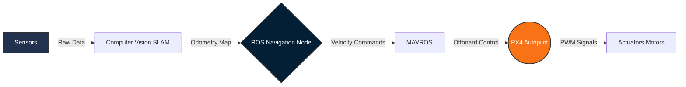

  <h1>Hi there, I'm Abdelfattah Ahmed 👋</h1>
  <h3>Aeronautical Engineer | UAV Autonomy | Robotics</h3>
   
    
  
  

 

<table align="center" style="border-collapse: collapse; border: none;">
  <tr style="border: none;">
    <td width="60%" valign="top" style="border: none;">
      <h2>🚀 About Me</h2>
      <ul>
        <li>🎓 <b>Senior Aeronautical & Aerospace Engineering Student</b> at New Mansoura University.</li>
        <li>🤖 Deeply passionate about <b>Autonomous UAVs, Robotics, and Computer Vision</b>.</li>
        <li>🛩️ Completed over <b>+50 projects</b>, specializing in <b>CFD and FEA analyses</b>.</li>
        <li>🧠 Skilled in <b>Flight Control, Sensor Fusion (LiDAR/IMU), and Autonomous Navigation</b>.</li>
      </ul>
       
      <h3>🔬 Research Interests</h3>
      

        🛸 <b>Autonomous UAV Navigation</b> | 🗺️ <b>SLAM for Aerial Robotics</b>  
        🕹️ <b>Flight Control Systems</b> | 🌪️ <b>Aerodynamic Optimization</b>
      

    </td>
    <td width="40%" align="center" style="border: none;">
      
       
      <i><small>Real-time 3D Mapping & Navigation</small></i>
    </td>
  </tr>
</table>

 

## 💼 Experience & Training
* **Egyptian Space Agency (EgSA)** | *Space Keys Trainee* 🛰️
  * Hands-on training on critical satellite subsystems (EPS, OBC, Communications, ADCS, Payload, and Structures).
* **EgyptAir Training Academy** | *Airframe & Power Plant Trainee* ✈️
  * Gained practical experience with aircraft systems, maintenance processes, safety protocols, and aeronautical diagnostics.

 

## 🏆 Honors & Certifications
* ✈️ **Basic Introduction – Phase (1):** Completed the course for Undergraduate Aeronautical / Mechanical Engineers at **#EgyptAir** Training Academy.
* 🥉 **3rd Place, Smart Cities Hackathon:** Developed a *Cosmic Ray Energy Harvesting Satellite Project* for renewable energy transmission.
* 🎓 **Autonomous Mobile Robot ROS Diploma (Parts I & II):** Mastered ROS, Gazebo, SLAM, Kinematics, and EKF sensor fusion.
* 🚁 **Pixhawk Quadcopter Mastery:** Proficient in assembly, Mission Planner configuration, and autonomous mission planning.
* ⚙️ **ANSYS Simulation & FEA Training:** Advanced structural analysis, meshing, and finite element modeling.

 

## 🧠 Current Flagship Project

### 🛸 Autonomous UAV Platform: Threat Detection, 3D Mapping & Navigation
Developing a fully autonomous UAV system focusing on robust navigation and situational awareness through multisensor fusion.

* **Capabilities:** Fully autonomous navigation, Real-time 3D mapping, and onboard threat detection.
* **Algorithms:** Sensor fusion combining multiple sources (LiDAR, Camera, IMU) for accurate SLAM.

#### ⚙️ System Architecture (ROS-PX4 Integration)

**Tech Stack:**  
  

  

## 🚁 Featured Work

| Project | Description | Media / Links |
| :--- | :--- | :--- |
| **🦇 B2 Spirit Stealth CFD** | High-fidelity aerodynamic analysis of the B2 Spirit flying wing. Conducted **Streamline visualization** and pressure contour analysis using **ANSYS Fluent**. | [📊 View Streamlines](https://www.linkedin.com/posts/abdelfattah-ahmed7_cfd-cfd-aerodynamics-ugcPost-7434092373267292160-TXy7) |
| **📦 Autonomous Delivery Drone** | Integrated **PX4** with QGroundControl. Focused on emergency supply delivery with intelligent autonomous navigation and obstacle avoidance. | [📂 Repository](https://github.com/abdelfatah7) |
| **🏎️ ROS Autonomous Robot** | Developed a ROS-based robot using **SLAM Toolbox**, **AMCL** for localization, and **DWA** for dynamic local path control. | [📺 Project Demo](https://www.linkedin.com/in/abdelfattah-ahmed7/) |
| **🛸 UAV Offboard Control** | Executed fully autonomous flight maneuvers via **MAVROS** and **PX4**. Achieved complex trajectory patterns through custom **C++** nodes. | [🔗 Case Study](https://github.com/abdelfatah7) |

 

<b>✨ Click here to view more Aerospace, Automotive & CFD Projects</b>

 

| Project Title | Core Details & Technologies |
| :--- | :--- |
| **Jet Engine Fan CFD** | Simulated turbofan airflow dynamics at 100 rad/s applying RANS equations and a structured mesh. Visualized velocity patterns. |
| **Quadcopter Dynamics** | Transient CFD simulation with mesh motion at 7000 RPM to study aerodynamic flow behavior and vortices. |
| **Helicopter Main Rotor** | Transient CFD simulation to analyze vortex core formation, wake evolution, and blade-vortex interactions. |
| **Race Car Aerodynamics** | Evaluated aerodynamic performance and downforce generation, analyzing drag sources using Bernoulli's principle. |
| **NACA 0012 Optimization** | Analyzed airfoil at 10° AoA using k-w SST turbulence model to calculate Cl/Cd coefficients. |

 

## 🛠 Technical Arsenal

### 💻 Programming & Robotics

### ✈️ Aerospace & CFD

 

### 📈 GitHub Ecosystem

  
  
    
  

 

<table align="center" style="border: none; width: 100%;">
  <tr style="border: none;">
    <td align="left" style="border: none;">
      <h3>🌐 Languages</h3>
      
      
    </td>
    <td align="right" style="border: none;">
        
      
    </td>
  </tr>
</table>

   
  <b>Always open to collaborating on innovative UAV and Robotics projects! Let's connect.</b>

