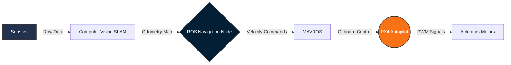

<h1 align="center">Hi there, I'm Abdelfattah Ahmed 👋</h1>
<h3 align="center">Aeronautical Engineer | UAV Autonomy | Robotics</h3>

   

  
  

---

## 🚀 About Me
I am a **Senior Aeronautical & Aerospace Engineering Student** at New Mansoura University, deeply passionate about bridging the gap between aerodynamic design and autonomous robotics. 

* 🛩️ **Experience:** Completed over **+50 projects**, specializing in **CFD and FEA analyses**.
* 🧠 **Specialties:** Flight Control, Sensor Fusion (LiDAR/IMU), and Autonomous Navigation.
* 🔭 **Research Interests:** Multi-Rotor & Hexacopter Autonomy | Computational Fluid Dynamics (CFD) | ROS-based Aerial Robotics & SLAM.

   
  
   
  <i><small>Real-time 3D Mapping & Navigation</small></i>

---

## 🏗️ Simulation & Mission Architecture
*A visual glimpse into my simulation environments and architectural planning.*

  
  &nbsp;
  
  &nbsp;
  

---

## 🧠 Current Flagship Project: Autonomous UAV Platform
Developing a fully autonomous UAV system focusing on robust navigation and situational awareness through multisensor fusion.

* **Capabilities:** Fully autonomous navigation, Real-time 3D mapping, and onboard threat detection.
* **Algorithms:** Sensor fusion combining multiple sources (LiDAR, Camera, IMU) for accurate SLAM.

**⚙️ System Architecture (ROS-PX4 Integration)**

*Tech Stack:*   

---

## 💼 Experience & Training
* 🛰️ **Egyptian Space Agency (EgSA)** | *Space Keys Trainee* * Hands-on training on critical satellite subsystems (EPS, OBC, Communications, ADCS, Payload, and Structures).
* ✈️ **EgyptAir Training Academy** | *Airframe & Power Plant Trainee* * Practical experience with aircraft systems, maintenance processes, safety protocols, and aeronautical diagnostics.

---

## 🚁 Featured Work

| Project | Description | Media / Links |
| :--- | :--- | :--- |
| **🦇 B2 Spirit Stealth CFD** | High-fidelity aerodynamic analysis. Conducted streamline visualization using **ANSYS Fluent**. | [📊 View Results](https://www.linkedin.com/posts/abdelfattah-ahmed7_cfd-cfd-aerodynamics-ugcPost-7434092373267292160-TXy7) |
| **📦 Autonomous Delivery Drone** | Integrated **PX4** with QGroundControl for emergency supply delivery with obstacle avoidance. | [📂 Repository](https://github.com/abdelfatah7) |
| **🏎️ ROS Autonomous Robot** | Developed a ROS robot using **SLAM Toolbox**, **AMCL** for localization, and **DWA**. | [📺 Project Demo](https://www.linkedin.com/in/abdelfattah-ahmed7/) |
| **🛸 UAV Offboard Control** | Executed autonomous flight maneuvers via **MAVROS** and **PX4** using custom **C++** nodes. | [🔗 Case Study](https://github.com/abdelfatah7) |

 

<b>✨ Click here to view more Aerospace, Automotive & CFD Projects</b>

 

* **Jet Engine Fan CFD:** Simulated turbofan airflow dynamics at 100 rad/s applying RANS equations.
* **Quadcopter Dynamics:** Transient CFD simulation with mesh motion at 7000 RPM to study aerodynamic flow behavior.
* **Helicopter Main Rotor:** Transient CFD simulation to analyze blade-vortex interactions.
* **Race Car Aerodynamics:** Evaluated downforce generation and analyzed drag sources.
* **NACA 0012 Optimization:** Analyzed airfoil at 10° AoA using k-w SST turbulence model.

---

## 🛠 Technical Arsenal

**💻 Programming & Robotics**  

  

**✈️ Aerospace & CFD**  

---

## 📈 GitHub Ecosystem

  
  
    
  

   
  
    
  <b>Always open to collaborating on innovative UAV and Robotics projects! Let's connect.</b>

