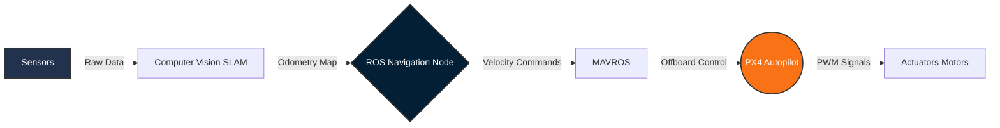

  <h1>Hi there, I'm Abdelfattah Ahmed 👋</h1>
  <h3>Aeronautical Engineer | UAV Autonomy | Robotics</h3>
   
    
  
  

---

## 🚀 About Me & Research

| 👨‍💻 Background & Focus | 🔬 Research Interests |
| :--- | :--- |
| • **Senior Aeronautical & Aerospace Engineering Student** at New Mansoura University. • Deeply passionate about **Autonomous UAVs, Robotics, and Computer Vision**. • Completed over **+50 projects**, specializing in **CFD and FEA analyses**. • Skilled in **Flight Control, Sensor Fusion, and Navigation**. | • **Autonomous UAV Navigation & SLAM** • **Flight Control Systems** • **Aerodynamic Optimization** • **Multi-Sensor Fusion (LiDAR/IMU)** |

---

## 💼 Experience & Training

* **Egyptian Space Agency (EgSA)** | *Space Keys Trainee* * Hands-on training on critical satellite subsystems (EPS, OBC, Communications, ADCS, Payload, and Structures).
* **EgyptAir Training Academy** | *Airframe & Power Plant Trainee* * Practical experience with aircraft systems, maintenance, safety protocols, and aeronautical diagnostics.

## 🏆 Honors & Certifications

* **Basic Introduction – Phase (1):** Completed the course for Undergraduate Aeronautical / Mechanical Engineers at EgyptAir.
* **3rd Place, Smart Cities Hackathon:** Developed a Cosmic Ray Energy Harvesting Satellite Project.
* **Autonomous Mobile Robot ROS Diploma:** Mastered ROS, Gazebo, SLAM, Kinematics, and EKF sensor fusion.
* **Pixhawk Quadcopter Mastery:** Proficient in assembly, Mission Planner configuration, and autonomous mission planning.
* **ANSYS Simulation & FEA Training:** Advanced structural analysis, meshing, and finite element modeling.

---

## 🧠 Flagship Project: Autonomous UAV Platform

Developing a fully autonomous UAV system focusing on robust navigation and situational awareness through multisensor fusion.

**Core Capabilities:**
1. Fully autonomous navigation
2. Real-time 3D mapping
3. Onboard threat detection

#### System Architecture (ROS-PX4 Integration)

#### Simulation & Trajectory

| Gazebo SITL Drone Simulation | Autonomous 3D Flight Trajectory |
| :---: | :---: |
|  |  |

---

## 🚁 Featured Work

| Project & Link | Visual Preview |
| :--- | :---: |
| [**B2 Spirit Stealth CFD**](https://www.linkedin.com/posts/abdelfattah-ahmed7_cfd-cfd-aerodynamics-ugcPost-7434092373267292160-TXy7) High-fidelity aerodynamic analysis. |  |
| [**Autonomous Delivery Drone**](https://github.com/abdelfatah7) PX4 emergency supply delivery. |  |
| [**ROS Autonomous Robot**](https://www.linkedin.com/in/abdelfattah-ahmed7/) SLAM Toolbox, AMCL, and DWA. |  |
| [**UAV Offboard Control**](https://github.com/abdelfatah7) MAVROS & PX4 trajectory execution. |  |

---

## 🛠 Technical Arsenal

### Programming & Robotics

### Aerospace & CFD

---

## 📈 GitHub Ecosystem

| Stats & Streak | Top Languages & Views |
| :---: | :---: |
|    |    |

 

  <b>Always open to collaborating on innovative UAV and Robotics projects! Let's connect.</b>

