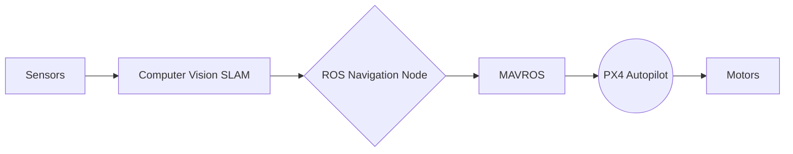
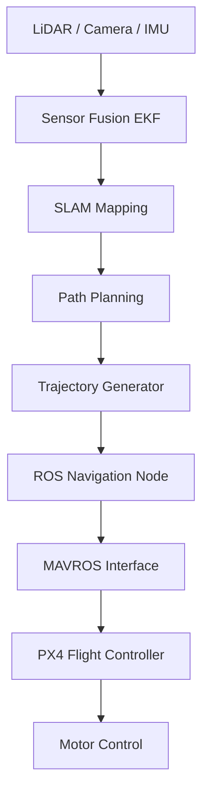

  <h1>Hi there, I'm Abdelfattah Ahmed 👋</h1>
  <h3>Aeronautical Engineer | UAV Autonomy | Robotics</h3>

  

    

  

  

---

# 🚀 About Me

<table>
<tr>
<td width="60%">

🎓 **Senior Aeronautical & Aerospace Engineering Student** at New Mansoura University  

🤖 Passionate about **Autonomous UAVs, Robotics, and Computer Vision**

🛩️ Completed **50+ engineering projects** focused on **CFD, FEA, and flight systems**

🧠 Skilled in **Flight Control, Sensor Fusion (LiDAR / IMU), and Autonomous Navigation**

### 🔬 Research Interests

🛸 Autonomous UAV Navigation  
🗺️ SLAM for Aerial Robotics  
🕹️ Flight Control Systems  
🌪️ Aerodynamic Optimization  

</td>

<td width="40%">

</td>
</tr>
</table>

---

# 💼 Experience & Training

### 🛰 Egyptian Space Agency (EgSA)
**Space Keys Trainee**

Hands-on exposure to satellite subsystems:

- Electrical Power System (EPS)
- On Board Computer (OBC)
- Attitude Determination & Control (ADCS)
- Communications
- Payload Systems
- Satellite Structures

---

### ✈ EgyptAir Training Academy
**Airframe & Power Plant Trainee**

Practical experience with:

- Aircraft structural systems  
- Aircraft maintenance procedures  
- Engine components and diagnostics  
- Safety and inspection workflows  

---

# 🏆 Honors & Certifications

✈ **Basic Introduction – Phase (1)**  
EgyptAir Training Academy – Aeronautical Engineers Course.

🥉 **3rd Place – Smart Cities Hackathon**  
Developed **Cosmic Ray Energy Harvesting Satellite Concept**.

🎓 **Autonomous Mobile Robot ROS Diploma**

Covered:

- ROS Fundamentals
- Gazebo Simulation
- SLAM
- EKF Sensor Fusion
- Robot Navigation

🚁 **Pixhawk Quadcopter Mastery**

- Frame assembly
- PX4 configuration
- Mission Planner
- Autonomous missions

⚙ **ANSYS Simulation & FEA Training**

- Structural analysis
- Meshing
- Finite element modeling

---

# 🧠 Current Flagship Project

## 🛸 Autonomous UAV Platform  
**Threat Detection • 3D Mapping • Autonomous Navigation**

Developing a **fully autonomous UAV system** capable of intelligent navigation and environmental perception.

### Core Capabilities

- Autonomous navigation
- Real-time 3D mapping
- Threat detection
- Sensor fusion SLAM

---

## ⚙️ System Architecture (ROS + PX4)

---

## 🧠 UAV Autonomy Software Stack

---

# 🚁 Featured Work

| Project | Description |
|------|------|
🦇 **B2 Spirit Stealth CFD** | Aerodynamic analysis using ANSYS Fluent with streamlines and pressure contours |
📦 **Autonomous Delivery Drone** | PX4 integration with autonomous navigation |
🏎 **ROS Autonomous Robot** | SLAM Toolbox + AMCL + DWA navigation |
🛸 **PX4 Offboard UAV Control** | MAVROS + C++ trajectory execution |

---

<b>More Aerospace & CFD Projects</b>

| Project | Description |
|------|------|
Jet Engine Fan CFD | Turbofan airflow simulation |
Quadcopter Dynamics | Transient mesh motion simulation |
Helicopter Rotor | Blade vortex interaction study |
Race Car Aerodynamics | Downforce & drag analysis |
NACA 0012 | Airfoil lift & drag optimization |

---

# 🛠 Technical Arsenal

## 💻 Programming & Robotics

---

## ✈ Aerospace & Simulation

---

# 🎥 UAV Simulation

Autonomous UAV trajectory execution in simulation

---

# 📈 GitHub Ecosystem

 

---

# 🌐 Languages

Arabic — Native  
English — Professional Proficiency

---

# ⚙ Engineering Philosophy

I focus on building **robust autonomous aerial systems** that combine:

- Aerodynamics  
- Robotics  
- Intelligent navigation  
- Sensor fusion  

My workflow integrates:

- Simulation-first development using Gazebo  
- UAV autonomy with ROS + PX4  
- Sensor fusion pipelines  
- CFD aerodynamic validation  

---

**Open to collaborating on UAV, Aerospace, and Robotics projects.**

